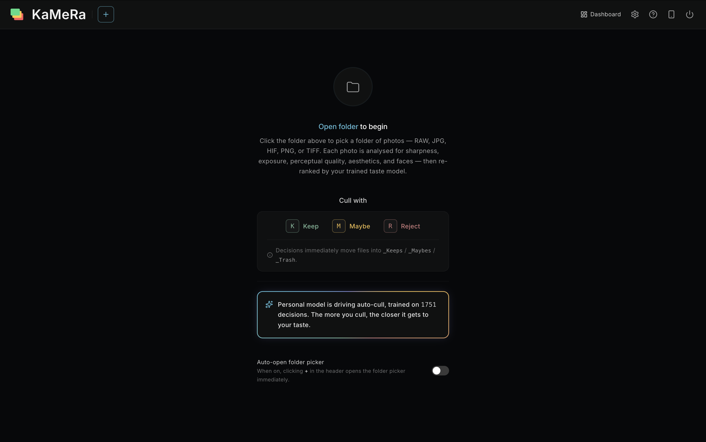
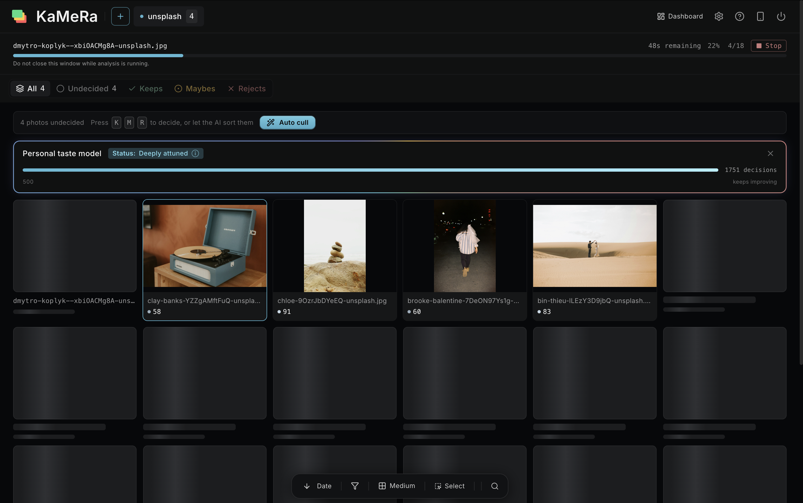
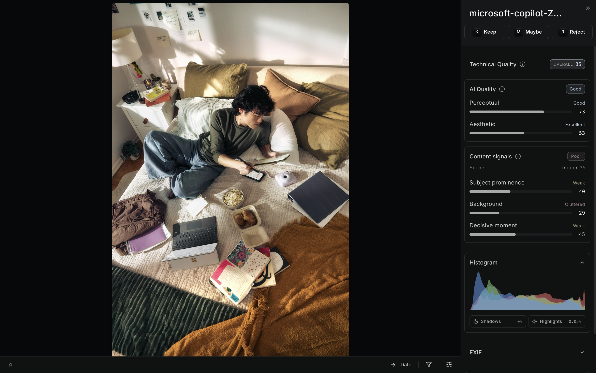
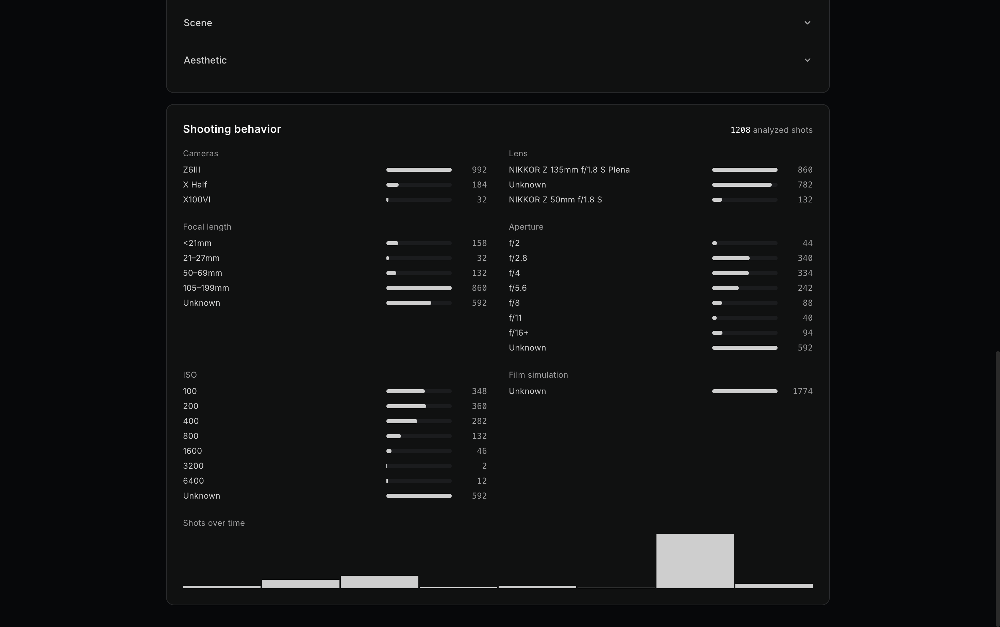
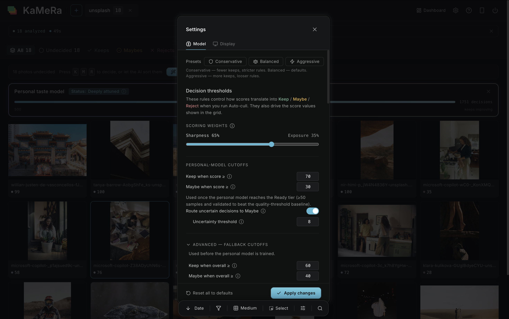

# KaMeRa

**A local, AI-assisted photo culling assistant for RAW shooters.**

KaMeRa helps you get through hundreds or thousands of frames after a shoot — sorting Keepers / Maybes / Rejects, finding the sharpest shot of a burst, surfacing duplicates, and learning your personal taste as you work. Everything runs on your own machine. No cloud, no uploads, no subscriptions.

Built by a senior UX designer learning to code, for personal use with three cameras (Fuji X100VI, Fuji X Half, Nikon Z6III). Sharing it publicly to see who finds it useful and what should change.

> **Status:** Early, working, in active use by the author. Not polished commercial software. Expect rough edges. Feedback very welcome — see the [Feedback](#feedback) section.

---

## Screenshots


*Landing view — the trained taste model is always visible at the top.*


*Grid view — every photo scored, decisions surfaced as colored rings, AI auto-cull one click away.*


*Detail view — technical and perceptual quality, content signals, histogram, EXIF.*


*Dashboard — your shooting behavior across every analyzed shot.*


*Settings — decision thresholds and scoring weights are user-tunable.*

---

## What it does

**Analyzes every photo on three levels:**

- **Technical** — sharpness (tile-based, p90 fusion), exposure, camera shake, clipping, EXIF rules.
- **Perceptual** — face & eye detection, image-quality score, aesthetic score, semantic embeddings for grouping bursts and duplicates, face-identity for People mode.
- **Personal** — a small machine-learning model trained on your own K/M/R decisions, predicting which photos you'd keep before you see them.

**Helps you cull faster:**

- `K` / `M` / `R` decisions on every screen — files move into `_Keeps/` / `_Maybes/` / `_Trash/` inside the source folder. RAW files are never modified.
- Writes XMP sidecars with `XMP:Rating` and `XMP:Label` — Lightroom, Capture One, Bridge, and Luminar Neo all pick these up automatically. The keepers land in your editor already starred.
- Group loupe with synchronized zoom for burst comparison.
- Optional AI-generated one-paragraph explanation per pick (via local Ollama).
- Per-photo undo with `U` / `Cmd+Z`.

---

## Try it

⚠️ **Heads-up:** KaMeRa currently runs from source, not a packaged app. You need a terminal, Python, and Node installed. macOS is the primary platform; Windows works but is less polished.

### 1. System dependencies

**macOS:**
```bash
brew install python@3.13 node exiftool ollama
brew install python-tk@3.13     # required for the folder picker on Python 3.13
```

**Windows:** install Python 3.10+, Node 18+, [ExifTool](https://exiftool.org), and [Ollama](https://ollama.com) from their respective installers.

### 2. Pull the vision model (one-time, ~5 GB)

```bash
ollama serve &                  # start daemon temporarily
ollama pull qwen2.5vl:7b        # download model
```

You can stop the manual `ollama serve` after — KaMeRa launches and shuts down its own daemon.

### 3. Clone and run

```bash
git clone https://github.com/pinnadel/kamera.git
cd kamera
./start.sh        # macOS / Linux
# or
start.cmd         # Windows
```

The first launch will create a Python venv, install dependencies, build the frontend, and open the app at `http://localhost:8000`. Expect 5–10 minutes the first time.

On first analysis, ML model weights (~1.5 GB total — TOPIQ, CLIP, SigLIP, FaceNet) download into `~/.cache/`. The first batch is slow; subsequent ones aren't.

---

## How to use it (the 60-second version)

1. **Pick a folder** of RAW/JPEG files (the "+" in the tab bar).
2. **Wait for analysis** — every photo gets scored. You can start culling before it finishes.
3. **Press `K` / `M` / `R`** on each photo. Files move into the subfolders immediately.
4. **`Enter` on a group** to open the group loupe — synchronized-zoom comparison of similar frames.
5. **`?`** opens the in-app shortcuts modal with everything else.

After ~50 decisions, KaMeRa's personal-style model starts predicting which photos you'd keep — that becomes the default sort and a faint cyan badge appears in the corner.

---

## Compatibility

| | |
|---|---|
| **Cameras tested** | Fujifilm X100VI · Fujifilm X Half · Nikon Z6III |
| **RAW formats** | `.RAF` (Fuji) · `.NEF` (Nikon, including Z6III HE\* compressed) |
| **Other formats** | `.jpg` · `.jpeg` · `.png` · `.heic` · `.hif` (Fuji camera-baked HEIF) |
| **Platforms** | macOS (primary) · Windows (works, less polished) · Linux (works but no menu-bar icon) |
| **Python** | 3.10+ (3.13 tested) |
| **Node** | 18+ |

If you have a camera that isn't in this list and you try it — please file an issue with what worked and what didn't.

---

## Feedback

If you try KaMeRa, I'd love to hear what happened — what broke, what felt wrong, what surprised you, what you wish it did. There are no rules about what kind of feedback is welcome.

- **Bugs or issues:** [open a GitHub issue](https://github.com/pinnadel/kamera/issues)
- **General thoughts or feature ideas:** same place, label it `feedback`
- **Camera/format compatibility reports:** especially welcome — Nikon Z* HE-compressed NEFs and Fuji X-Trans bodies in particular

I read every issue. Response time isn't guaranteed — this is a solo personal project.

---

## A note on contributions

This is currently a personal learning project that I'm sharing for feedback, not actively seeking code contributions. If you have an idea or a bug fix, the best path is to **open an issue first** so we can talk about it before you spend time on a PR. I may close PRs that arrive without prior discussion.

That said: bug reports, RAW files that don't decode correctly, and detailed feedback are all extremely useful and explicitly welcomed.

---

## What's under the hood

For curious readers — a quick map of how it works.

**Tech stack**

| Layer | Tools |
|---|---|
| Frontend | React 19 · Tailwind CSS v4 · Vite · react-hotkeys-hook |
| Backend | Python 3.10+ · FastAPI · uvicorn · SQLite |
| Image processing | rawpy · Pillow · pillow-heif · OpenCV · ExifRead · pyexiftool |
| Phase 2 ML | MediaPipe · pyiqa (TOPIQ) · SigLIP-2 · FaceNet · LAION aesthetic predictor |
| Phase 3 ML | scikit-learn GBR · NumPy |
| LLM | Ollama (local daemon) + qwen2.5vl:7b vision model |
| Launcher | rumps (macOS menu bar) · pystray (Windows / Linux tray) |

**How the personal model works**

Every K/M/R decision freezes a 31-dimension feature vector into a durable `training_samples` table (sharpness, exposure, IQA, aesthetic, clipping, face features, expression, camera physics, scene one-hots, SigLIP content axes). A scikit-learn gradient boosting regressor predicts a *delta* from the baseline `overall_score`, scaled and clamped to produce `personal_score = clamp(overall_score + delta×25, 0, 100)`. Auto-trains in the background after every 10 new decisions past a 30-sample floor. A 20-member sub-sampled ensemble proxies prediction uncertainty so near-boundary photos get routed to Maybe rather than committed to a hard decision.

Sprint-level history is in [docs/CHANGELOG.md](docs/CHANGELOG.md).

---

## Keyboard shortcuts (essentials)

| Key | Action |
|---|---|
| `K` | Keep — moves file to `_Keeps/` |
| `M` | Maybe — moves file to `_Maybes/` |
| `R` | Reject — moves file to `_Trash/` |
| `U` / `Cmd+Z` | Undo the selected photo's decision |
| `C` | Add/remove photo from Compare set (max 4) |
| `Space` | Open Compare (when 2+ staged) · otherwise open focused photo or group |
| `Enter` | Open focused group in the loupe |
| `← → ↑ ↓` | Navigate the grid |
| `Esc` | Close layers (compare → loupe → detail) |
| `?` | Open the full shortcuts modal |

---

## Repo layout

```
kamera/
├── backend/                FastAPI app, SQLite, file movement
├── phase1_technical/       sharpness, exposure, shake, burst, EXIF
├── phase2_quality/         face, IQA, aesthetic, similarity, identity, LLM
├── phase3_learning/        feature extractor, personal model, auto-trainer
├── frontend/src/           React app — App.jsx + views, modals, hooks, ui
├── tests/                  pytest suite — run `pytest` from repo root
├── data/                   SQLite + model weights + previews (auto-created)
├── docs/                   CHANGELOG, design docs, FAQ, learning journal
├── launcher.py             process supervisor + menu-bar app
├── requirements.txt
├── start.sh / start.cmd    macOS+Linux / Windows launchers
└── NOTICES.md              third-party licenses and model attribution
```

---

## License and attribution

KaMeRa is published source-available for personal use and feedback. No explicit license has been chosen yet — under default copyright, you may read the source and run it locally for personal use, but redistribution, hosting, or commercial use are not granted.

Several pre-trained ML model weights bundled at runtime (TOPIQ, CLIP ViT-L/14, FaceNet/VGGFace2) are research-licensed; the project as a whole is consequently non-commercial. The complete third-party attribution list — every Python and Node dependency, every model weight, and the underlying license of each — is in [NOTICES.md](NOTICES.md).

If you'd like to use KaMeRa beyond personal evaluation, please open an issue and we can talk.
